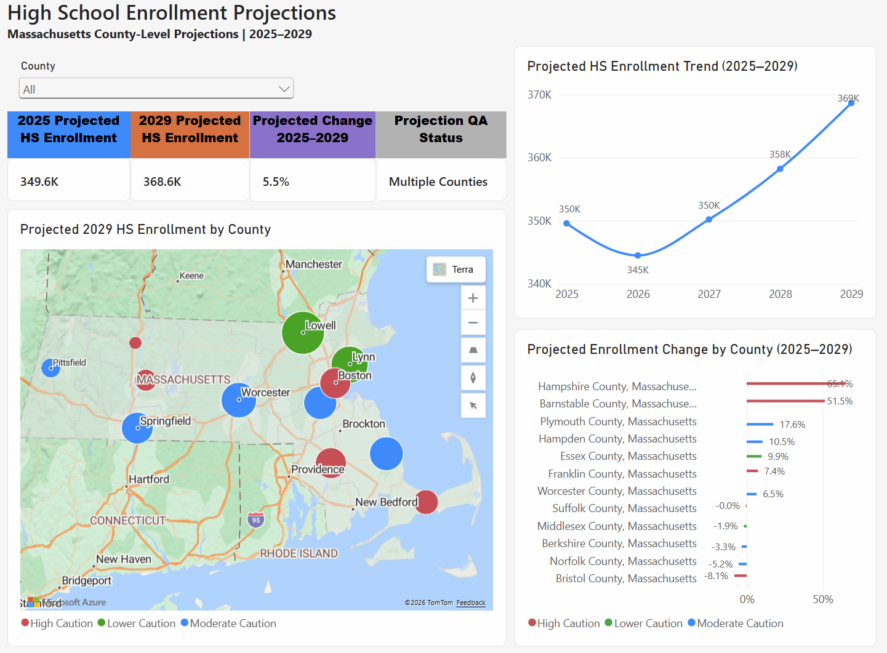

# County-Level High School Enrollment Projection

**Bentley University — Enrollment Management Business Intelligence**

This project develops county-level high school enrollment projections for Massachusetts using U.S. Census Bureau American Community Survey (ACS) enrollment data. The projections cover Grades 9–12 for 2025–2029 and are intended to support Enrollment Management research and recruitment planning.

## Business Purpose

The purpose of this project is to provide a reproducible method for evaluating projected changes in the high-school-aged enrollment market across Massachusetts counties.

The projections can support Enrollment Management in identifying geographic areas for further recruitment analysis, including potential decisions related to school visits, recruitment travel, advertising, mailing campaigns, and other market-planning activities.

The projections should be evaluated alongside Bentley-specific recruitment performance data before making recruitment decisions.

## Data Source

The project uses the U.S. Census Bureau American Community Survey (ACS) 1-Year Detailed Tables.

**Table:** B14007 — School Enrollment by Detailed Level of School for the Population 3 Years and Over

The analysis uses enrollment estimates for Grades 4–12.

Historical ACS years used:

- 2019
- 2021
- 2022
- 2023
- 2024

Standard ACS 1-Year estimates were not available for 2020. Following the approved project methodology, 2020 enrollment values were interpolated using the corresponding 2019 and 2021 enrollment estimates.

2020 Estimated Enrollment = (2019 Enrollment + 2021 Enrollment) / 2

## Why Grades 4–12 Are Used

Although the final output focuses on Grades 9–12, historical enrollment data beginning with Grade 4 are required to support the recursive projection process through 2029.

Younger grades act as feeder cohorts for future high-school grades. For example, students represented in Grade 4 in 2024 provide the starting cohort needed to estimate Grade 9 enrollment in 2029.

The final reporting output therefore contains Grades 9–12, while Grades 4–8 support the underlying projection calculations.

## Projection Methodology

The projection process follows the sequence:

ACS B14007 Enrollment Data  
→ Data Cleaning and Reshaping  
→ 2020 Interpolation  
→ Annual Cohort Survival Ratios (CSR)  
→ Weighted Average Cohort Survival Ratios (WACSR)  
→ 2025–2029 Enrollment Projections  
→ Quality Assurance

### Cohort Survival Ratio (CSR)

A cohort survival ratio measures the relationship between enrollment in one grade and enrollment in the following grade in the next year.

For example:

CSR for Grade 11 → Grade 12 in 2024:

CSR = Grade 12 Enrollment in 2024 / Grade 11 Enrollment in 2023

### Weighted Average Cohort Survival Ratio (WACSR)

Five annual cohort survival ratios are combined into a weighted average.

The most recent CSR receives a weight of 40%, while each of the previous four CSR values receives a weight of 15%.

WACSR = (0.15 × CSR1) + (0.15 × CSR2) + (0.15 × CSR3) + (0.15 × CSR4) + (0.40 × Most Recent CSR)

### Enrollment Projection

The WACSR values are applied recursively to the most recent enrollment cohorts.

For example:

Projected Grade 12 Enrollment in 2025 = Grade 11 Enrollment in 2024 × Grade 11→12 WACSR

The process is repeated across grade transitions and projection years to generate Grade 9–12 estimates for 2025–2029.

## Quality Assurance

The completed pipeline produced the following validation results:

| QA Check | Result |
|---|---:|
| Historical enrollment records | 648 |
| Interpolated 2020 records | 108 |
| Missing historical values | 0 |
| Duplicate historical records | 0 |
| Negative historical enrollments | 0 |
| CSR calculations | 480 |
| WACSR calculations | 96 |
| Flagged WACSR values | 6 |
| Final projections | 240 |
| Missing projection values | 0 |
| Duplicate projection records | 0 |
| Negative projected enrollments | 0 |

Six WACSR values were identified during QA as unusually high progression ratios. These values were retained rather than automatically modified so that the methodology remains transparent and reproducible.

## Interpretation and Limitations

ACS B14007 values are survey estimates of grade-level enrollment rather than longitudinal records tracking the same individual students from one year to the next.

Therefore, cohort survival ratios should be interpreted as progression ratios between grade-level enrollment estimates rather than literal student survival or graduation rates.

Ratios greater than 1.0 can occur because of changes in population, migration, enrollment patterns, survey estimation variability, and other factors.

Counties affected by flagged WACSR values should be interpreted with additional caution because unusual historical progression ratios can propagate through recursive projections.

Margins of error were not incorporated into the calculations for this project.

The projections represent demographic market signals and should not independently determine recruitment strategy. Bentley-specific measures such as applications, admits, deposits, enrollment, and yield should also be considered.

## Project Structure

### `data/raw/`
Contains the original ACS B14007 files downloaded from the U.S. Census Bureau.

### `data/processed/`
Contains cleaned and calculated datasets generated by the Python pipeline, including:

- `historical_enrollment_2019_2024.csv`
- `cohort_survival_rates.csv`
- `weighted_cohort_survival_rates.csv`
- `wacsr_qa_flags.csv`

### `output/`
Contains the final projection dataset:

- `high_school_enrollment_projections_2025_2029.csv`

### `enrollment_projection.py`
Main Python script used to execute the enrollment projection pipeline.

### Documentation
Supporting documentation includes the project methodology, data dictionary, and Power BI reporting materials. 

## Power BI Dashboard

An interactive Power BI dashboard was developed to communicate projected enrollment trends, county-level differences, grade-level changes, and projection quality-assurance results.

